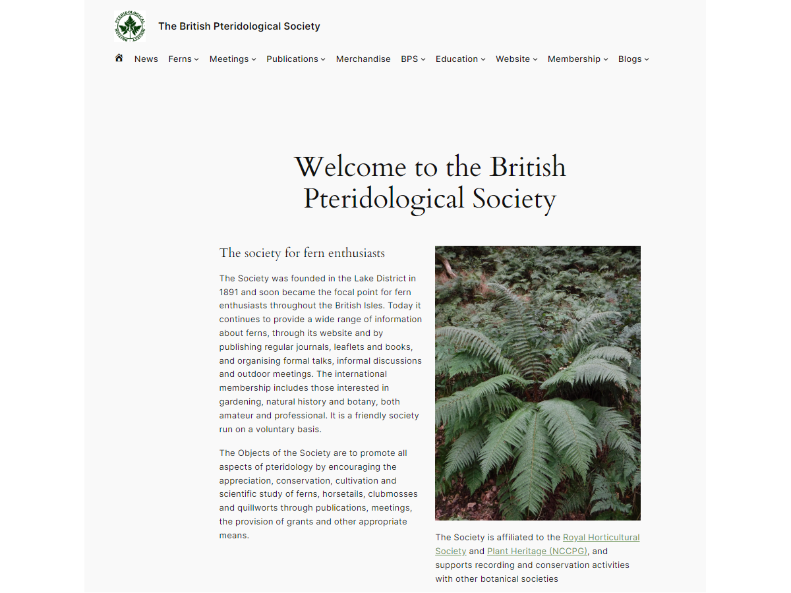

# ebps2024 

* Contributors: bobbingwide
* Requires at least: 6.4.2
* Tested up to: 6.5.4
* Version: 0.0.1
* Tags: full-site-editing
* License: GPL-3.0
* License URI: http://www.gnu.org/licenses/gpl-3.0.html

## Description 
Child theme of Twenty Twenty-Four with theme.json from Twenty Twenty-Four

## Change Log 
# 0.0.1 
* Added: Custom CSS for Events calendar 'widget'. This actually needs to be in Additional CSS since the style.css file isn't enqueud at present.

# 0.0.0 
* Added: Copied / cobbled from tt4ai

## Licence 

ebps2024 is distributed under the terms of the GNU GPL.

* This program is free software: you can redistribute it and/or modify
it under the terms of the GNU General Public License as published by
the Free Software Foundation, either version 3 of the License, or
(at your option) any later version.

This program is distributed in the hope that it will be useful,
but WITHOUT ANY WARRANTY; without even the implied warranty of
MERCHANTABILITY or FITNESS FOR A PARTICULAR PURPOSE. See the
GNU General Public License for more details.
